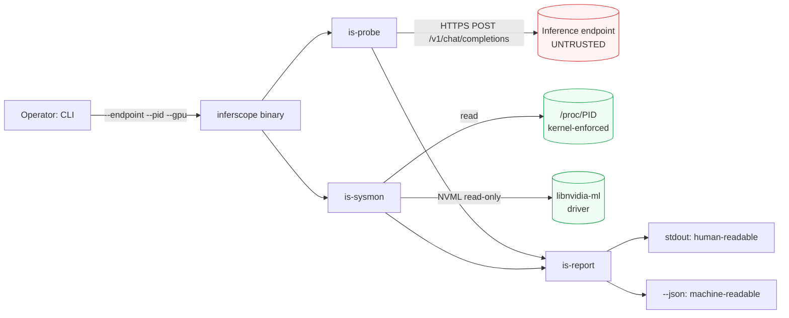

# inferscope

> **Not just how fast a request was — where the time went.**
> A profiler for LLM inference engines that correlates per-token client
> latency with what the engine is doing on the GPU, on one shared clock.

[](https://github.com/MicheleCampi/inferscope/actions/workflows/ci.yml)
[](LICENSE)
[](rust-toolchain.toml)
[](#status)

inferscope measures what an LLM inference engine actually does when
it serves a request. It drives an engine through its
OpenAI-compatible HTTP API, captures per-token timing, and
correlates that with the engine process resource footprint — so you
can see not just *how fast* a request was, but *where the time went*
and *whether resources were used well*.

It is engine-agnostic. Anything that speaks the OpenAI API —
llama.cpp's server, mistral.rs, vLLM, Ollama, TGI — is a target.

## Status

**v0.5.0 released.** The profiling stack is stable across CPU and
NVIDIA GPU. GPU support is NVIDIA-only today; all GPU and energy
features are gated behind the `gpu-nvidia` feature flag.

- **CPU foundation** (v0.1): token timing capture, `/proc`-based
  process resource sampling, derived metrics, text/JSON reporting.
- **NVIDIA GPU sampling** (v0.2): per-device utilization, memory,
  and power via NVML.
- **Energy & efficiency** (v0.4): total energy from the NVML
  hardware energy counter, with derived tokens-per-joule and
  tokens-per-watt. Validated end-to-end against a real llama.cpp
  workload on an NVIDIA A10 — see
  [`validation-results/`](validation-results/) for the captured
  evidence.
- **Attribution** (v0.4): KV-cache hit rate scraped from a
  Prometheus endpoint (ADR-011), per-phase energy split
  prefill vs decode with the divergence between two apportionments
  as the signal (ADR-012), and per-step attribution across agentic
  trajectories (ADR-013). Per-step energy is measured on an A10
  against vLLM. **No KV-cache hit rate has been measured against a real
  vLLM endpoint.** Until 2026-08-02 the schema named the series as
  vLLM's source registers them rather than as its endpoint exposes them,
  so every scrape against real vLLM failed and only the simulator
  answered; the A10 evidence of 2026-07-21 carries zeros for that
  reason. Fixed in `cd0ece6`, and still unmeasured after the H100 run
  of 2026-09-05 for a second reason: that campaign drives load
  externally and attaches with `--sample-only`, a path that spawns the
  phase and speculative scrapes but not the KV one. Recorded as a gap
  in ADR-016, not closed — see the ADR-011 postscript.
  [`validation-results/`](validation-results/) states the bounds of
  each run.
- **Multi-engine** (v0.5): SGLang is read alongside vLLM (ADR-014).
  The two do not expose the same quantity — vLLM counts cache hits
  truncated to a block boundary, SGLang counts exact tokens at its
  default page size — so a hit rate now carries the accounting that
  produced it into the report, and the rendered text says which.
  The engine is declared with `--engine`, never inferred from the
  scrape body. Parser and schema selection are validated against
  fixtures transcribed from SGLang's own collector source and
  cross-checked against its tests; a live scrape against a running
  SGLang server needs a GPU and has not been done.
- **Speculative decoding** (ADR-016): the three vLLM speculative
  counters on the same clock as the energy sampler, so what rejected
  drafts cost can be read in joules rather than inferred from an
  acceptance rate. Measured on an H100 PCIe on 2026-09-05, with
  `synthetic_acceptance_rates` making acceptance an independent
  variable rather than a property of whichever draft model was to hand
  — eleven runs, baselines opening and closing the session 0.13%
  apart, realized acceptance length matching the configured value on
  every point. **No energy crossover exists in the swept range.**
  Speculation costs less per committed token than not speculating at
  every acceptance length, including at zero acceptance: 652880 draft
  tokens computed, none accepted, and the run still committed its
  tokens at 0.897x the baseline. Figures, the mechanism, and the
  source-level checks behind the attribution are in
  [`validation-results/adr-016-h100-spec/RESULTS.md`](validation-results/adr-016-h100-spec/RESULTS.md).
  One target/draft pair, one workload, one device.

## What it measures

For each request sent to an engine, inferscope captures:

- **Time-to-first-token (TTFT)** — latency from request to the
  first generated token.
- **Inter-token latency** — the per-token generation cadence, and
  its distribution, from which real tokens-per-second and its
  variance are derived.
- **Total latency** — end-to-end request duration.
- **Process resource footprint** — resident memory, CPU
  utilization, and thread count of the engine process, sampled
  over the lifetime of the request.

- **GPU resource footprint** *(with `gpu-nvidia`)* — per-device
  utilization, memory, and power draw, sampled via NVML over the
  request lifetime.
- **Energy and efficiency** *(with `gpu-nvidia`)* — total energy
  consumed, read from the NVML hardware energy counter
  (`nvmlDeviceGetTotalEnergyConsumption`) with a trapezoidal
  power-integration fallback, plus derived tokens-per-joule and
  tokens-per-watt.
- **Per-step trajectory attribution** *(with `--steps-file`)* —
  energy, token, and KV-cache deltas sliced per agentic step (LLM
  calls and tool executions), joined offline against driver-emitted
  step boundaries, with an unattributed remainder that reconciles
  exactly to the whole-run figure. Valid at controlled concurrency
  only (one trajectory in flight), and only for steps longer than the
  counter sampling period — shorter steps report absence rather than a
  zero. Per-step **energy** is measured against a live vLLM serving
  Qwen2.5-7B-Instruct on an NVIDIA A10; per-step **KV-cache** figures
  are exercised on fixtures only, not yet on real hardware. See
  [`validation-results/adr-013-a10-vllm/`](validation-results/adr-013-a10-vllm/),
  which states what that run does and does not establish.

The output is a structured report (text and JSON) that aggregates
these across a run.

## Quick example

Profiling a local llama.cpp server running Qwen 2.5 0.5B Q4 on a
4-vCPU AMD EPYC VM:

```
$ inferscope \
    --endpoint http://127.0.0.1:8080 \
    --model qwen \
    --prompt "Write three short sentences about Italian coffee." \
    --max-tokens 80 \
    --pid 3319

Probe summary
  Tokens generated      80
  Time to first token   25 ms
  Generation rate       82.7 tokens/s
  Total latency         981 ms

Inter-token latency (from 79 intervals)
  mean      12 ms      max       15 ms
  p50       12 ms      p95       14 ms
  p99       15 ms

Process resource usage (21 samples)
  RSS                peak 588 MiB  mean 588 MiB
                     min  588 MiB  final 588 MiB
  CPU utilization    mean 371%
  Threads            14 throughout
```

The same run with `--json` produces a single document carrying both
the raw per-token timestamps and the derived metrics, so a consumer
can recompute differently without re-running the probe.

When the engine exposes a Prometheus endpoint, inferscope also reads
its KV-cache counters over the same window. The engine's metric
vocabulary is declared, not guessed:

```
$ inferscope \
    --endpoint http://127.0.0.1:8000 \
    --model facebook/opt-125m \
    --prompt "Explain why espresso is served in small cups." \
    --max-tokens 120 \
    --metrics-endpoint http://127.0.0.1:8000/metrics \
    --engine vllm \
    --metrics-period-ms 300
# Output below is from llm-d-inference-sim, not a GPU. See the note
# after this block: no KV-cache rate has yet been read off real vLLM.

Probe summary
  Tokens generated      120
  Time to first token   303 ms
  Generation rate       24.7 tokens/s
  Total latency         5.118 s

KV-cache (prefix cache, probe window):
  Hit rate           53.3%  (144 / 270 tokens)
  Accounting         numerator block-aligned, denominator exact: rate is a lower bound
```

The window is a delta between two scrapes, so a run shorter than two
scrape periods reports no rate rather than a wrong one, and says which
of the two it was. The `Accounting` line is why the engine has to be
declared: vLLM counts hits truncated to a block boundary against an
exact-token denominator, so its rate is a lower bound, while SGLang at
its default page size counts both exactly. Use `--engine sglang
--page-size <n>` there.

Built with `--features otel-export`, inferscope can additionally
emit the same report as an OpenTelemetry trace via OTLP/HTTP:

```
$ docker run -d --rm --name jaeger -p 4318:4318 -p 16686:16686 \
    jaegertracing/all-in-one:latest

$ inferscope \
    --endpoint http://127.0.0.1:8080 \
    --model qwen \
    --prompt "Write three short sentences about Italian coffee." \
    --max-tokens 80 \
    --pid 3319 \
    --otel-endpoint http://127.0.0.1:4318

# Open http://127.0.0.1:16686 in a browser to see the Jaeger UI.
```

The Jaeger UI then renders the run as a single `inferscope.run`
span with one `token.arrival` event per generated token on the
timeline, plus the derived aggregates as span attributes. Token
arrivals appear at their correct positions on the wall clock,
making the inter-token cadence directly readable. The standard
`OTEL_EXPORTER_OTLP_ENDPOINT` env var is honoured if the flag is
not supplied. Design recorded in
[ADR-008](docs/adr/008-opentelemetry-export.md).

For agentic workloads, `--steps-file trajectory.jsonl` joins
driver-emitted step boundaries (JSONL: `step_id`, `kind` of
`llm_call` | `tool`, wall-clock start/end in unix nanoseconds)
against the run's timelines after the run — the two processes never
communicate. The JSON report then carries a `trajectory` section
with per-step energy and token figures, dropped-step diagnostics,
and the unattributed remainder. Works in both probe and
`--sample-only` mode. Design recorded in
[ADR-013](docs/adr/013-trajectory-level-attribution.md).
Validated 2026-07-21 on an NVIDIA A10 against vLLM in
`--sample-only` mode: exact energy reconciliation
(steps + unattributed == total), zero dropped steps, per-step
token deltas from the phase-counter scrape. That run also
exposed a delta-baseline defect in the join, since fixed; the
captured report is kept unregenerated as the artifact that
exposed it, and
[`validation-results/adr-013-a10-vllm/`](validation-results/adr-013-a10-vllm/)
records both the numbers and their bounds.

## Scope

inferscope is built on **outside-in profiling**: the engine is
treated as a black box, observed through its HTTP API, the
operating system, and the GPU driver. This is engine-agnostic and
ships as a complete tool. The one exception is the metrics scrape
(ADR-011), which reads the engine's own Prometheus counters
read-only across a network boundary — still no instrumentation
inside the engine process.

What that buys, and what it costs, is recorded in
[ADR-003](docs/adr/003-sysmon-scope-and-correlation.md): host-side
sampling attributes resources to a process tree, not to work
inside the engine's scheduler.

**Engine-internal instrumentation** — attributing time and memory
to specific phases like KV cache management or attention
computation, from inside the engine — remains out of scope. The
reasoning behind that boundary is recorded in
[ADR-001](docs/adr/001-profiling-scope.md).

## Architecture



inferscope is a Cargo workspace of five crates, each with a single
responsibility:

| Crate | Responsibility |
|-------|----------------|
| `is-core` | Shared types: metrics, report structures, errors. Pure data, no I/O, no async. |
| `is-probe` | Drives an OpenAI-compatible endpoint and captures per-token timing. |
| `is-sysmon` | Samples the engine process resource footprint from `/proc`. |
| `is-report` | Renders collected metrics as structured text and JSON. |
| `inferscope` | The CLI binary that ties the layers together. |

Every crate depends on `is-core` for shared vocabulary. `is-core`
itself depends on nothing with a runtime, so the data definitions
stay free of I/O concerns.

The full set of design decisions — scope, timing representation,
sysmon scope, report metrics and output format — is recorded in
[`docs/adr/`](docs/adr/).

## Building

inferscope pins a minimum supported Rust version of 1.85 via
`rust-toolchain.toml`. With a Rust toolchain installed:

    git clone https://github.com/MicheleCampi/inferscope.git
    cd inferscope
    cargo build --release --workspace

The CLI binary lands at `target/release/inferscope`. Run
`inferscope --help` for the full argument list.

Two arguments are mandatory rather than defaulted. `--engine` is
required whenever `--metrics-endpoint` is supplied, and `--page-size`
is required with `--engine sglang`: neither has a value inferscope
could assume without asserting something about the caller's engine
that it cannot read from a scrape.

Optional Cargo features:

- `gpu-nvidia` — enables NVML-based GPU sampling and the `--gpu`
  flag. Requires the NVIDIA driver and `libnvidia-ml.so` at runtime.
- `otel-export` — enables OpenTelemetry export via OTLP/HTTP and
  the `--otel-endpoint` flag. Adds roughly nine transitive crates;
  the default build is unchanged.

Combine features as needed:

    cargo build --release --features "gpu-nvidia otel-export"

## Documentation

| Document | Purpose |
|---|---|
| [`SECURITY.md`](SECURITY.md) | Threat model, controls, known limitations |
| [`RUNBOOK.md`](RUNBOOK.md) | Eight failure modes operators commonly hit, with Detection–Diagnosis–Fix structure |
| [`CHANGELOG.md`](CHANGELOG.md) | Version-by-version release notes |
| [`docs/adr/`](docs/adr/) | Architecture Decision Records — profiling scope, sampling correlation, GPU and process-tree sampling, energy and efficiency, KV-cache hit rate, per-phase and per-trajectory attribution, multi-engine metric schema; [indexed here](docs/adr/README.md) |
| [`docs/runbooks/runpod-gpu-validation.md`](docs/runbooks/runpod-gpu-validation.md) | End-to-end procedure for validating GPU sampling on RunPod (~$1–2/run) |
| [`benchmarks/`](benchmarks/) | Cross-hardware comparison (L4/H100/4×A40), multi-device deep-dive, and vLLM vs llama.cpp head-to-head on H100 |
| [`Dockerfile`](Dockerfile) | Multi-stage build, non-root user, CUDA 13.0.2 runtime |
| [`deploy/`](deploy/) | Example docker-compose and Kubernetes Job manifests for running inferscope as a one-shot profiling workload |

## Roadmap

Released — see [`CHANGELOG.md`](CHANGELOG.md) for the detail:

- **v0.1.0** (May 2026) — API-level profiling: token timing,
  `/proc` resource correlation, text and JSON reports, CLI.
- **v0.2.x** (May 2026) — NVIDIA GPU sampling via NVML behind the
  `gpu-nvidia` feature flag ([ADR-005](docs/adr/005-gpu-resource-sampling.md)).
- **v0.3.0** (May 2026) — per-device GPU metrics
  ([ADR-007](docs/adr/007-per-device-gpu-metrics.md)).
- **v0.4.0** (July 2026) — NVML energy and efficiency (ADR-010),
  KV-cache hit rate from a Prometheus endpoint (ADR-011),
  per-phase energy attribution (ADR-012), per-step trajectory
  attribution (ADR-013), plus the sample-only mode that had shipped
  on main but never been tagged. The OTLP export was tagged here too,
  but did not compile under its own feature; fixed on 2026-07-29 and
  now covered by an `all-features` CI job.

Not planned: AMD GPU sampling via `amd-smi` was listed here for
two releases and never started — it is off the roadmap rather
than perpetually deferred. Engine-internal instrumentation stays
out of scope by design ([ADR-001](docs/adr/001-profiling-scope.md)).

## License

Licensed under the [Apache License, Version 2.0](LICENSE).
