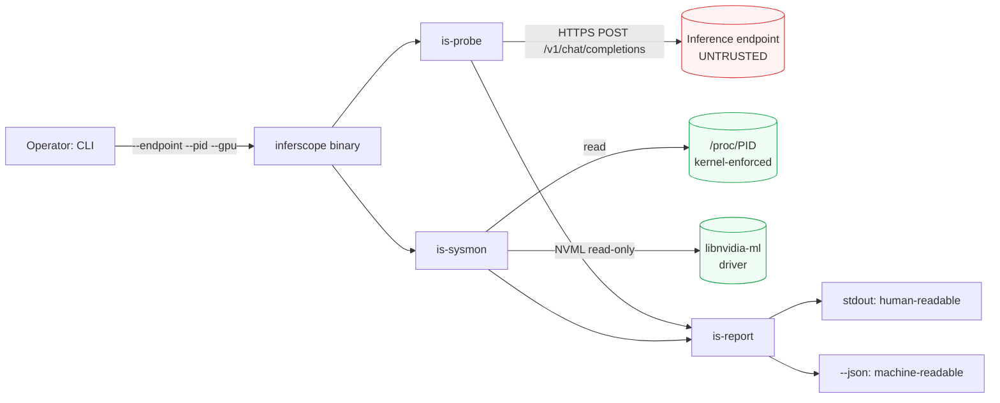

# inferscope

> Profiling and observability for LLM inference engines.

[](https://github.com/MicheleCampi/inferscope/actions/workflows/ci.yml)
[](LICENSE)
[](rust-toolchain.toml)
[](#status)

inferscope measures what an LLM inference engine actually does when
it serves a request. It drives an engine through its
OpenAI-compatible HTTP API, captures per-token timing, and
correlates that with the engine process resource footprint — so you
can see not just *how fast* a request was, but *where the time went*
and *whether resources were used well*.

It is engine-agnostic. Anything that speaks the OpenAI API —
llama.cpp's server, mistral.rs, vLLM, Ollama, TGI — is a target.

## Status

**v0.3.0 released.** The profiling stack is stable across CPU and
NVIDIA GPU. GPU support is NVIDIA-only today; all GPU and energy
features are gated behind the `gpu-nvidia` feature flag.

- **CPU foundation** (v0.1): token timing capture, `/proc`-based
  process resource sampling, derived metrics, text/JSON reporting.
- **NVIDIA GPU sampling** (v0.2): per-device utilization, memory,
  and power via NVML.
- **Energy & efficiency** (v0.3): total energy from the NVML
  hardware energy counter, with derived tokens-per-joule and
  tokens-per-watt. Validated end-to-end against a real llama.cpp
  workload on an NVIDIA A10 — see
  [`validation-results/`](validation-results/) for the captured
  evidence.

## What it measures

For each request sent to an engine, inferscope captures:

- **Time-to-first-token (TTFT)** — latency from request to the
  first generated token.
- **Inter-token latency** — the per-token generation cadence, and
  its distribution, from which real tokens-per-second and its
  variance are derived.
- **Total latency** — end-to-end request duration.
- **Process resource footprint** — resident memory, CPU
  utilization, and thread count of the engine process, sampled
  over the lifetime of the request.

- **GPU resource footprint** *(with `gpu-nvidia`)* — per-device
  utilization, memory, and power draw, sampled via NVML over the
  request lifetime.
- **Energy and efficiency** *(with `gpu-nvidia`)* — total energy
  consumed, read from the NVML hardware energy counter
  (`nvmlDeviceGetTotalEnergyConsumption`) with a trapezoidal
  power-integration fallback, plus derived tokens-per-joule and
  tokens-per-watt.
- **Per-step trajectory attribution** *(with `--steps-file`)* —
  energy, token, and KV-cache deltas sliced per agentic step (LLM
  calls and tool executions), joined offline against driver-emitted
  step boundaries, with an unattributed remainder that reconciles
  exactly to the whole-run figure. Valid at controlled concurrency
  only (one trajectory in flight).

The output is a structured report (text and JSON) that aggregates
these across a run.

## Quick example

Profiling a local llama.cpp server running Qwen 2.5 0.5B Q4 on a
4-vCPU AMD EPYC VM:

```
$ inferscope \
    --endpoint http://127.0.0.1:8080 \
    --model qwen \
    --prompt "Write three short sentences about Italian coffee." \
    --max-tokens 80 \
    --pid 3319

Probe summary
  Tokens generated      80
  Time to first token   25 ms
  Generation rate       82.7 tokens/s
  Total latency         981 ms

Inter-token latency (from 79 intervals)
  mean      12 ms      max       15 ms
  p50       12 ms      p95       14 ms
  p99       15 ms

Process resource usage (21 samples)
  RSS                peak 588 MiB  mean 588 MiB
                     min  588 MiB  final 588 MiB
  CPU utilization    mean 371%
  Threads            14 throughout
```

The same run with `--json` produces a single document carrying both
the raw per-token timestamps and the derived metrics, so a consumer
can recompute differently without re-running the probe.

Built with `--features otel-export`, inferscope can additionally
emit the same report as an OpenTelemetry trace via OTLP/HTTP:

```
$ docker run -d --rm --name jaeger -p 4318:4318 -p 16686:16686 \
    jaegertracing/all-in-one:latest

$ inferscope \
    --endpoint http://127.0.0.1:8080 \
    --model qwen \
    --prompt "Write three short sentences about Italian coffee." \
    --max-tokens 80 \
    --pid 3319 \
    --otel-endpoint http://127.0.0.1:4318

# Open http://127.0.0.1:16686 in a browser to see the Jaeger UI.
```

The Jaeger UI then renders the run as a single `inferscope.run`
span with one `token.arrival` event per generated token on the
timeline, plus the derived aggregates as span attributes. Token
arrivals appear at their correct positions on the wall clock,
making the inter-token cadence directly readable. The standard
`OTEL_EXPORTER_OTLP_ENDPOINT` env var is honoured if the flag is
not supplied. Design recorded in
[ADR-008](docs/adr/008-opentelemetry-export.md).

For agentic workloads, `--steps-file trajectory.jsonl` joins
driver-emitted step boundaries (JSONL: `step_id`, `kind` of
`llm_call` | `tool`, wall-clock start/end in unix nanoseconds)
against the run's timelines after the run — the two processes never
communicate. The JSON report then carries a `trajectory` section
with per-step energy and token figures, dropped-step diagnostics,
and the unattributed remainder. Works in both probe and
`--sample-only` mode. Design recorded in
[ADR-013](docs/adr/013-trajectory-level-attribution.md).

## Scope

v0.1.0 is built on **API-level profiling**: the engine is treated
as a black box, observed through its HTTP API and the operating
system. This is engine-agnostic and ships as a complete, useful
tool.

**Engine-internal instrumentation** — attributing time and memory
to specific phases like KV cache management or attention
computation — is the direction for v0.2 and beyond. The reasoning
behind this sequencing is recorded in
[ADR-001](docs/adr/001-profiling-scope.md).

**NVIDIA GPU resource monitoring** via NVML is the focus of v0.2,
now in development on the [`gpu/v0.2`](https://github.com/MicheleCampi/inferscope/tree/gpu/v0.2) branch. The
timing portion of inferscope is engine-agnostic and works against
GPU engines today, but on the main branch the resource portion reads
`/proc` only and so describes the CPU-side process. See
[ADR-003](docs/adr/003-sysmon-scope-and-correlation.md).

## Architecture



inferscope is a Cargo workspace of five crates, each with a single
responsibility:

| Crate | Responsibility |
|-------|----------------|
| `is-core` | Shared types: metrics, report structures, errors. Pure data, no I/O, no async. |
| `is-probe` | Drives an OpenAI-compatible endpoint and captures per-token timing. |
| `is-sysmon` | Samples the engine process resource footprint from `/proc`. |
| `is-report` | Renders collected metrics as structured text and JSON. |
| `inferscope` | The CLI binary that ties the layers together. |

Every crate depends on `is-core` for shared vocabulary. `is-core`
itself depends on nothing with a runtime, so the data definitions
stay free of I/O concerns.

The full set of design decisions — scope, timing representation,
sysmon scope, report metrics and output format — is recorded in
[`docs/adr/`](docs/adr/).

## Building

inferscope pins a minimum supported Rust version of 1.85 via
`rust-toolchain.toml`. With a Rust toolchain installed:

    git clone https://github.com/MicheleCampi/inferscope.git
    cd inferscope
    cargo build --release --workspace

The CLI binary lands at `target/release/inferscope`. Run
`inferscope --help` for the full argument list.

Optional Cargo features:

- `gpu-nvidia` — enables NVML-based GPU sampling and the `--gpu`
  flag. Requires the NVIDIA driver and `libnvidia-ml.so` at runtime.
- `otel-export` — enables OpenTelemetry export via OTLP/HTTP and
  the `--otel-endpoint` flag. Adds roughly nine transitive crates;
  the default build is unchanged.

Combine features as needed:

    cargo build --release --features "gpu-nvidia otel-export"

## Documentation

| Document | Purpose |
|---|---|
| [`SECURITY.md`](SECURITY.md) | Threat model, controls, known limitations |
| [`RUNBOOK.md`](RUNBOOK.md) | Eight failure modes operators commonly hit, with Detection–Diagnosis–Fix structure |
| [`CHANGELOG.md`](CHANGELOG.md) | Version-by-version release notes |
| [`docs/adr/`](docs/adr/) | Eight Architecture Decision Records covering profiling scope, sampling correlation, GPU resource sampling, process-tree aggregation, per-device GPU metrics, OpenTelemetry export |
| [`docs/runbooks/runpod-gpu-validation.md`](docs/runbooks/runpod-gpu-validation.md) | End-to-end procedure for validating GPU sampling on RunPod (~$1–2/run) |
| [`benchmarks/`](benchmarks/) | Cross-hardware comparison (L4/H100/4×A40), multi-device deep-dive, and vLLM vs llama.cpp head-to-head on H100 |
| [`Dockerfile`](Dockerfile) | Multi-stage build, non-root user, CUDA 13.0.2 runtime |
| [`deploy/`](deploy/) | Example docker-compose and Kubernetes Job manifests for running inferscope as a one-shot profiling workload |

## Roadmap
- **v0.1.0** (May 2026) — released. API-level profiling: token
  timing, `/proc`-based resource footprint correlation, text and
  JSON reports, CLI.
- **v0.2** — in development on
  [`gpu/v0.2`](https://github.com/MicheleCampi/inferscope/tree/gpu/v0.2).
  NVIDIA GPU sampling via NVML (VRAM, SM utilisation, temperature,
  power) behind a `gpu-nvidia` feature flag. See
  [ADR-005](docs/adr/005-gpu-resource-sampling.md).
- **v0.3** — AMD GPU sampling via `amd-smi`, the successor to
  the (deprecating) `rocm-smi`. Deferred from v0.2 to wait for
  `amd-smi` to reach a stable interface.
- **v0.4 and beyond** — engine-internal instrumentation:
  phase-level attribution of time and memory inside the inference
  engine (KV cache, attention, sampling). See
  [ADR-001](docs/adr/001-profiling-scope.md).
## License

Licensed under the [Apache License, Version 2.0](LICENSE).
